# El Crack del Barrio — Documentación Técnica y Plan de Desarrollo

> Documento de referencia para el equipo de desarrollo. Incluye diagramas de flujo, secuencia, estados, modelo de datos y arquitectura, además del plan de acción completo para pasar del prototipo interactivo (`vitrina_deportiva.html`) a una app en producción.

**Índice**
1. [Visión general del producto](#1-visión-general-del-producto)
2. [Diagrama de casos de uso](#2-diagrama-de-casos-de-uso)
3. [Diagramas de flujo (flowcharts)](#3-diagramas-de-flujo-flowcharts)
4. [Diagramas de secuencia](#4-diagramas-de-secuencia)
5. [Diagramas de estados](#5-diagramas-de-estados)
6. [Modelo de datos (entidad-relación)](#6-modelo-de-datos-entidad-relación)
7. [Arquitectura del sistema](#7-arquitectura-del-sistema)
8. [Plan de acción para el desarrollo](#8-plan-de-acción-para-el-desarrollo)

---

## 1. Visión general del producto

**El Crack del Barrio** conecta a dos roles:

- **Jugador**: crea un perfil deportivo (fotos, videos, clubes, disponibilidad), lo verifica con DNI, y contrata planes para ganar visibilidad.
- **Captador / DT**: explora, filtra, compara y contacta jugadores; agenda pruebas y guarda búsquedas/alertas.

El prototipo actual (`vitrina_deportiva.html`) es un **artefacto funcional del lado del cliente** con datos simulados y persistencia local vía `window.storage`. Este documento traza el camino hacia una versión real con backend, base de datos y pagos.

---

## 2. Diagrama de casos de uso

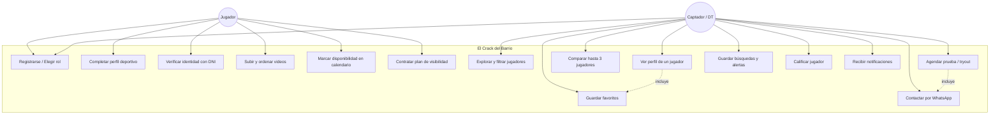

---

## 3. Diagramas de flujo (flowcharts)

### 3.1 Flujo general de la app (onboarding → rol → pantallas)

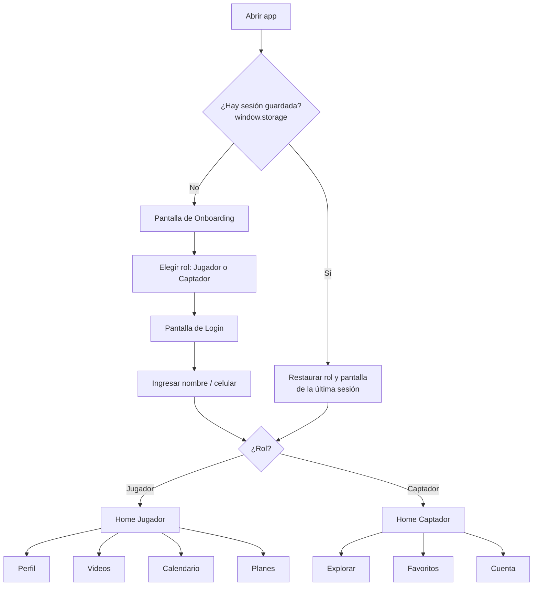

### 3.2 Flujo — Jugador completa su perfil

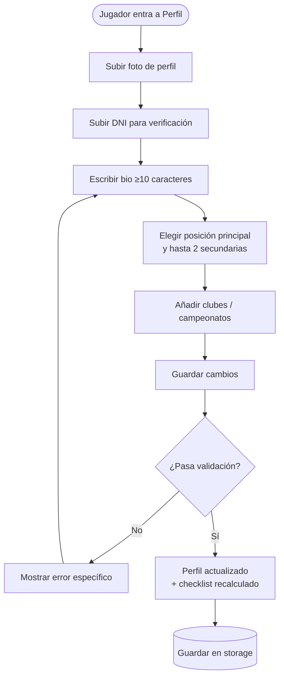

### 3.3 Flujo — Captador busca y contacta un jugador

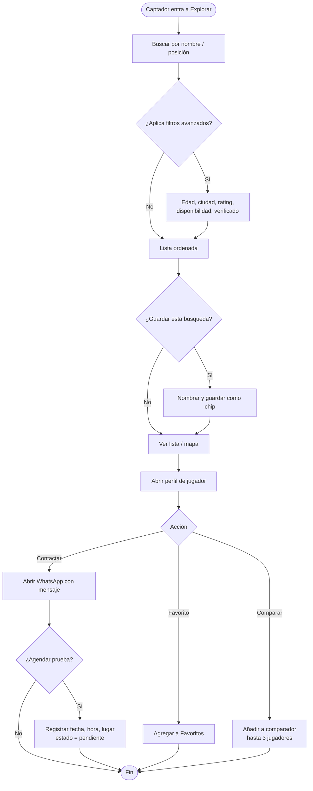

### 3.4 Flujo — Contratación de plan (Jugador)

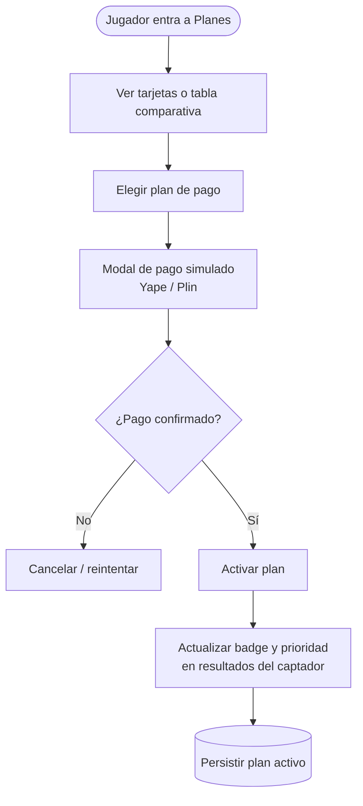

---

## 4. Diagramas de secuencia

### 4.1 Secuencia — Arranque de la app con sesión persistida

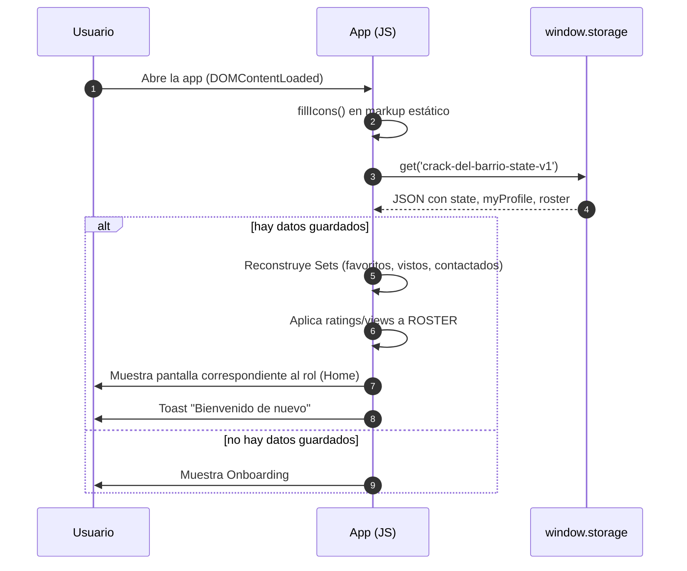

### 4.2 Secuencia — Captador contacta a un jugador

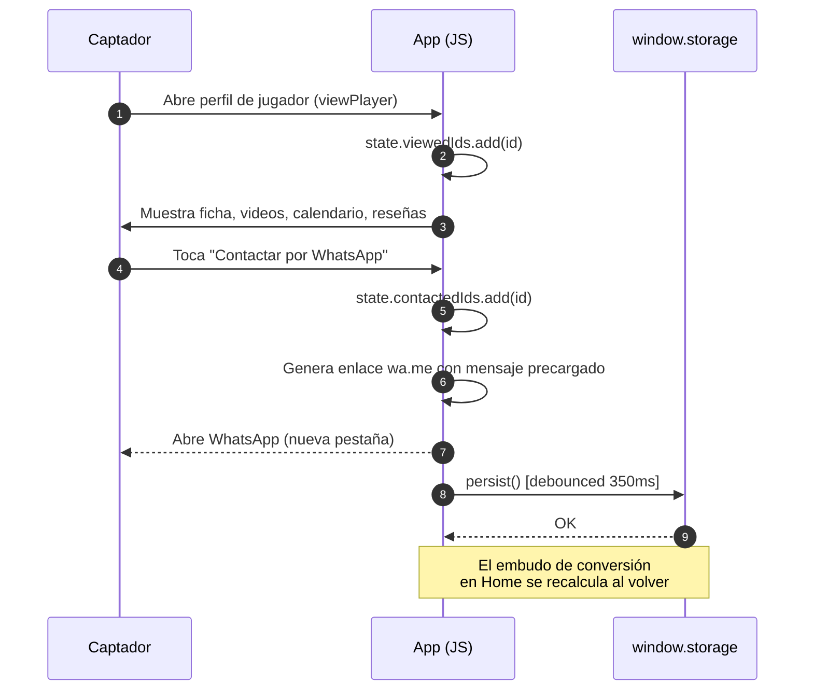

### 4.3 Secuencia — Guardar progreso (persist genérico)

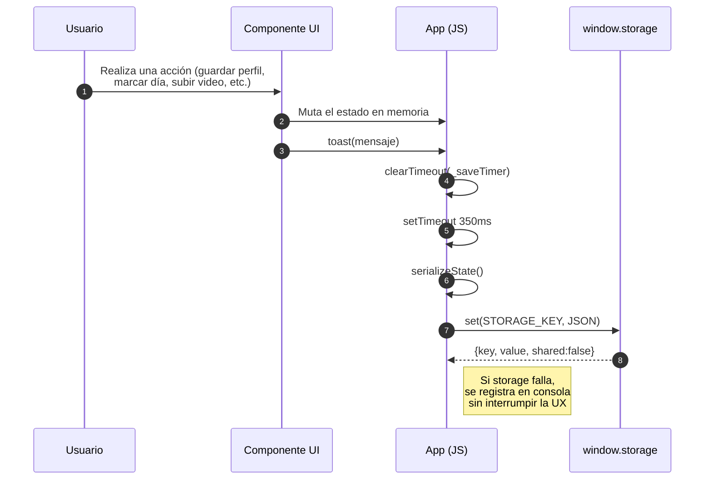

### 4.4 Secuencia — Agendar una prueba (tryout)

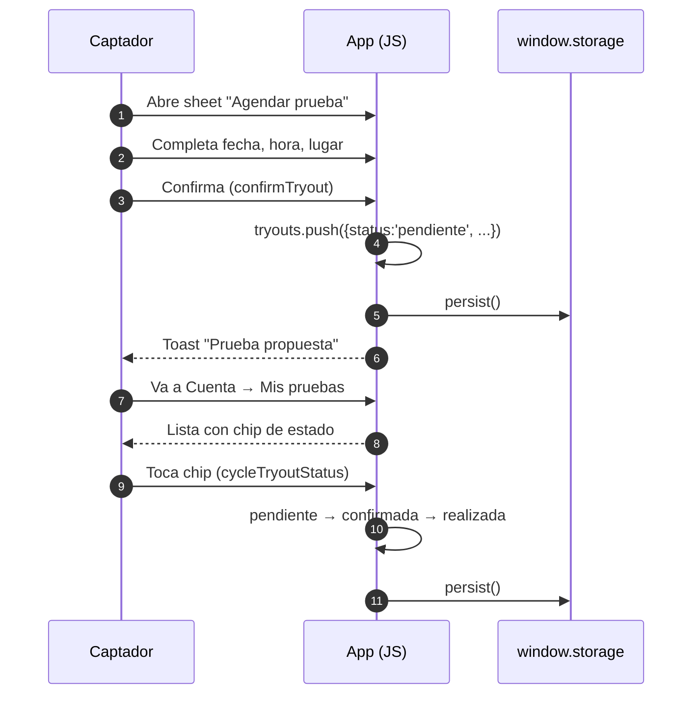

---

## 5. Diagramas de estados

### 5.1 Estado de una prueba (tryout)

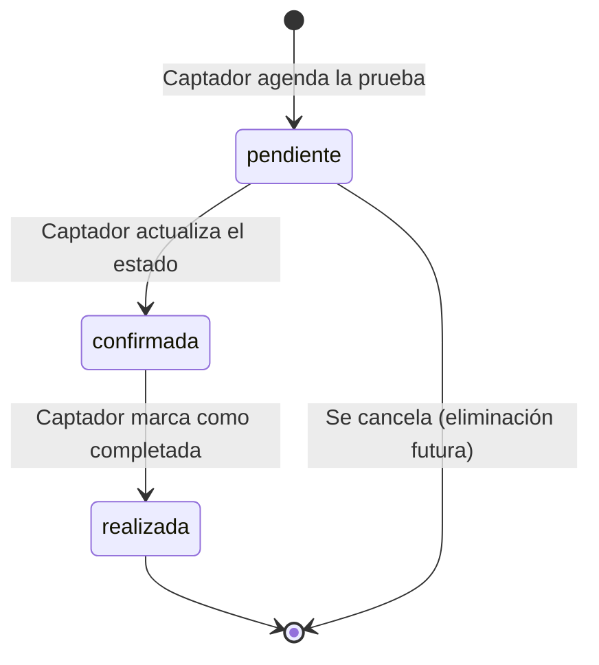

### 5.2 Estado de un plan del jugador

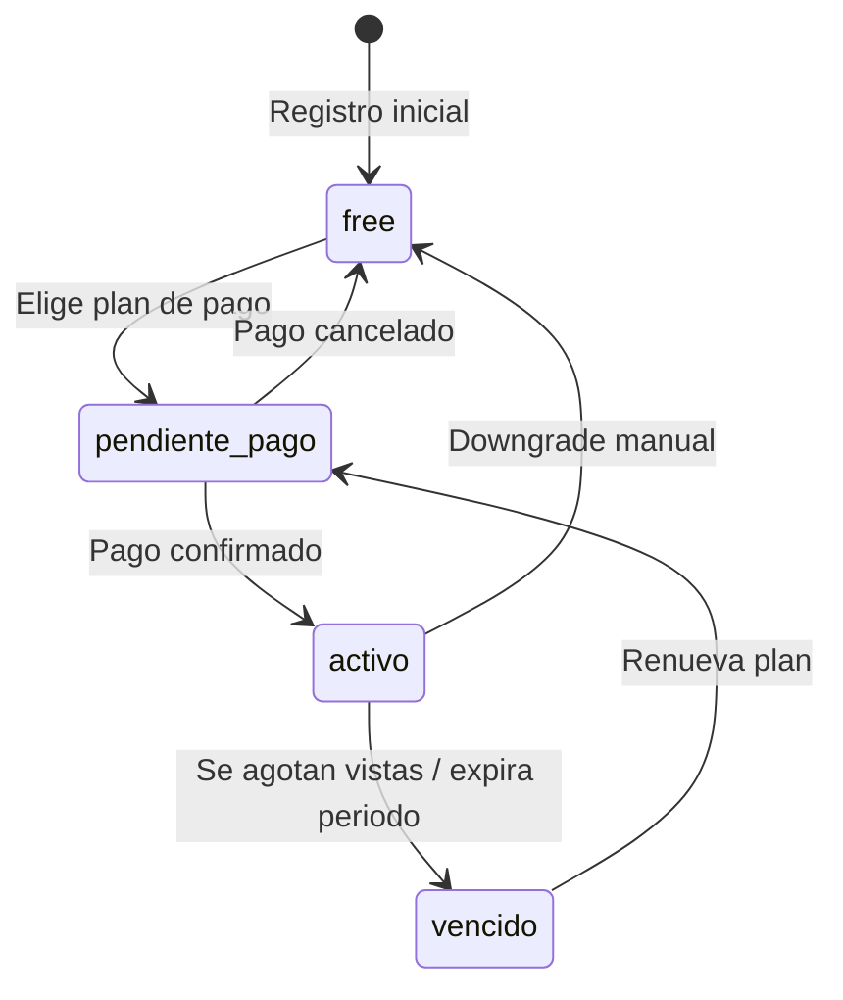

### 5.3 Estado de verificación del jugador

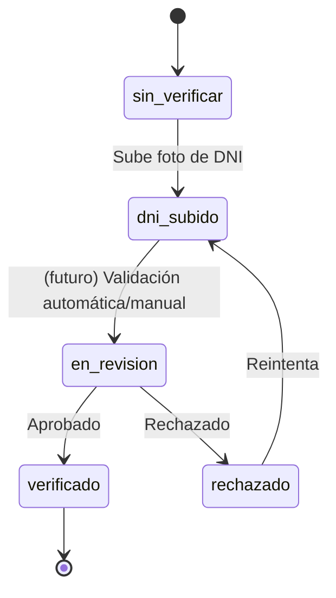

---

## 6. Modelo de datos (entidad-relación)

> Refleja el modelo actual en memoria (`state`, `myProfile`, `ROSTER`, `PLANS`) proyectado a un esquema relacional para el backend.

```mermaid
erDiagram
  USUARIO ||--o| PERFIL_JUGADOR : "tiene (si rol=jugador)"
  USUARIO ||--o| PERFIL_CAPTADOR : "tiene (si rol=captador)"
  USUARIO {
    string id PK
    string nombre
    string celular
    string rol "jugador | captador"
    datetime creado_en
  }

  PERFIL_JUGADOR {
    string id PK
    string usuario_id FK
    string foto_url
    string dni_url
    bool   verificado
    string bio
    string posicion_principal
    string[] posiciones_secundarias
    int    edad
    string ciudad
    float  rating
    string plan_id FK
    datetime plan_expira
  }

  VIDEO {
    string id PK
    string jugador_id FK
    string titulo
    string thumb_url
    string video_url
    int    vistas
    bool   destacado
    int    orden
  }
  PERFIL_JUGADOR ||--o{ VIDEO : "sube"

  CLUB {
    string id PK
    string jugador_id FK
    string nombre
    string tipo "club | campeon"
    int    anio
  }
  PERFIL_JUGADOR ||--o{ CLUB : "registra"

  DISPONIBILIDAD {
    string id PK
    string jugador_id FK
    date   fecha
    string estado "disponible | contratado | no_disponible"
    time   hora_desde
    time   hora_hasta
  }
  PERFIL_JUGADOR ||--o{ DISPONIBILIDAD : "marca"

  PLAN {
    string id PK
    string nombre
    decimal precio
    string unidad
    string[] beneficios
  }
  PERFIL_JUGADOR }o--|| PLAN : "contrata"

  PAGO {
    string id PK
    string jugador_id FK
    string plan_id FK
    decimal monto
    string metodo "yape | plin | tarjeta"
    string estado "pendiente | confirmado | fallido"
    datetime creado_en
  }
  PERFIL_JUGADOR ||--o{ PAGO : "realiza"

  PERFIL_CAPTADOR {
    string id PK
    string usuario_id FK
    string club_representa
    string zona_interes
    string plan_id FK
  }

  FAVORITO {
    string id PK
    string captador_id FK
    string jugador_id FK
    datetime creado_en
  }
  PERFIL_CAPTADOR ||--o{ FAVORITO : "guarda"
  PERFIL_JUGADOR ||--o{ FAVORITO : "es guardado en"

  CONTACTO {
    string id PK
    string captador_id FK
    string jugador_id FK
    datetime creado_en
  }
  PERFIL_CAPTADOR ||--o{ CONTACTO : "inicia"

  PRUEBA {
    string id PK
    string captador_id FK
    string jugador_id FK
    date   fecha
    time   hora
    string lugar
    string estado "pendiente | confirmada | realizada"
  }
  PERFIL_CAPTADOR ||--o{ PRUEBA : "agenda"
  PERFIL_JUGADOR ||--o{ PRUEBA : "recibe"

  CALIFICACION {
    string id PK
    string captador_id FK
    string jugador_id FK
    int    estrellas
    string comentario
  }
  PERFIL_CAPTADOR ||--o{ CALIFICACION : "otorga"

  BUSQUEDA_GUARDADA {
    string id PK
    string captador_id FK
    string nombre
    json   filtros
  }
  PERFIL_CAPTADOR ||--o{ BUSQUEDA_GUARDADA : "guarda"

  ALERTA {
    string id PK
    string captador_id FK
    string posicion
    string ciudad
    int    edad_max
  }
  PERFIL_CAPTADOR ||--o{ ALERTA : "configura"

  NOTIFICACION {
    string id PK
    string usuario_id FK
    string tipo
    string texto
    bool   leido
    datetime creado_en
  }
  USUARIO ||--o{ NOTIFICACION : "recibe"
```

---

## 7. Arquitectura del sistema

### 7.1 Estado actual (prototipo)

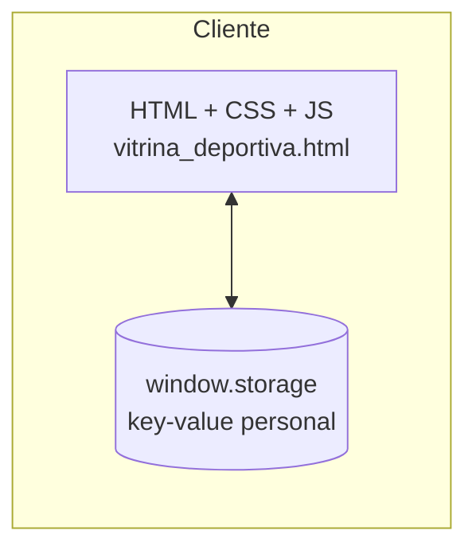

### 7.2 Arquitectura objetivo (producción)

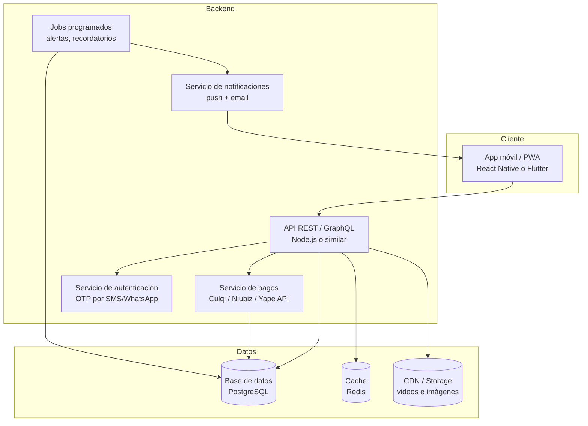

---

## 8. Plan de acción para el desarrollo

### 8.1 Resumen de fases

| Fase | Objetivo | Duración estimada |
|---|---|---|
| 0. Validación del prototipo | Confirmar flujos con usuarios reales | 1–2 semanas |
| 1. Diseño técnico | Arquitectura, esquema de BD, contratos de API | 1 semana |
| 2. Backend base | Auth, usuarios, perfiles | 2 semanas |
| 3. Módulo Jugador | Perfil, videos, calendario | 2 semanas |
| 4. Módulo Captador | Explorar, favoritos, comparar, contacto | 2 semanas |
| 5. Pagos y planes | Integración Yape/Plin/tarjeta | 1.5 semanas |
| 6. Notificaciones y alertas | Push, jobs programados | 1 semana |
| 7. QA y pruebas | Funcional, usabilidad, carga | 1.5 semanas |
| 8. Beta cerrada | Lanzamiento con grupo reducido | 2 semanas |
| 9. Lanzamiento y métricas | Publicación y monitoreo | continuo |

**Duración total estimada hasta beta pública: ~14–15 semanas** (equipo pequeño de 2–3 personas).

---

### 8.2 Fase 0 — Validación del prototipo

- [ ] Compartir el artefacto interactivo con 5–8 jugadores y 3–5 captadores reales.
- [ ] Recoger feedback sobre el flujo de registro, el explorar/filtrar y el flujo de pago.
- [ ] Priorizar ajustes de UX antes de invertir en backend.
- [ ] Definir métricas de éxito iniciales (perfiles completados, contactos generados, pruebas agendadas).

### 8.3 Fase 1 — Diseño técnico

- [ ] Elegir stack: backend (Node.js/NestJS o similar), base de datos (PostgreSQL), frontend móvil (React Native / Flutter / PWA).
- [ ] Formalizar el modelo de datos (sección 6) en migraciones de base de datos.
- [ ] Definir contratos de API (REST/GraphQL) para cada pantalla del prototipo.
- [ ] Definir política de almacenamiento de videos/imágenes (CDN, límites de tamaño, compresión).
- [ ] Definir estrategia de autenticación (OTP por SMS o WhatsApp, dado que el login actual es solo nombre + celular).

### 8.4 Fase 2 — Backend base (Auth + Usuarios)

- [ ] Endpoint de registro/login con verificación de celular.
- [ ] Gestión de sesión (JWT o similar) y selección de rol.
- [ ] CRUD de usuario base.
- [ ] Middleware de autorización por rol (jugador vs. captador).

### 8.5 Fase 3 — Módulo Jugador

- [ ] CRUD de perfil deportivo (foto, bio, posición principal y secundarias, ciudad).
- [ ] Subida y verificación de DNI (integrar validación manual o servicio tipo RENIEC/terceros).
- [ ] CRUD de videos con orden y video destacado; integración con CDN.
- [ ] CRUD de disponibilidad (calendario mensual y semanal).
- [ ] Cálculo de "perfil completo" y checklist en backend (evitar lógica solo en cliente).
- [ ] Endpoint de estadísticas (vistas por día, contactos recibidos).

### 8.6 Fase 4 — Módulo Captador

- [ ] Endpoint de exploración con filtros (posición, edad, ciudad, rating, verificado, disponibilidad por fecha).
- [ ] Favoritos (guardar/quitar).
- [ ] Comparador (2–3 jugadores) con datos consolidados.
- [ ] Contacto (registro de evento "contactado" + deep link a WhatsApp).
- [ ] Agenda de pruebas con estados (pendiente/confirmada/realizada).
- [ ] Calificaciones y reseñas de jugadores.
- [ ] Búsquedas guardadas y alertas configurables (requiere job programado, ver 8.8).
- [ ] Vista de mapa: reemplazar mock por geolocalización real (lat/lng por distrito o del propio jugador).

### 8.7 Fase 5 — Pagos y planes

- [ ] Definir planes reales (precio, beneficios, duración o cupo de vistas).
- [ ] Integrar pasarela de pago (Yape/Plin vía API de un agregador, o Culqi/Niubiz para tarjetas).
- [ ] Webhook de confirmación de pago → activar plan.
- [ ] Manejo de expiración y renovación automática/manual.
- [ ] Panel simple de facturación para soporte.

### 8.8 Fase 6 — Notificaciones y alertas

- [ ] Servicio de push notifications (Firebase Cloud Messaging u OneSignal).
- [ ] Job programado que evalúa `ALERTA` contra nuevos jugadores/actualizaciones y dispara notificación.
- [ ] Notificaciones in-app con estado leído/no leído persistido en backend.
- [ ] Recordatorio automático a jugadores con calendario desactualizado (>5 días).

### 8.9 Fase 7 — QA y pruebas

- [ ] Pruebas funcionales de cada flujo (registro, perfil, pago, contacto, prueba, comparador).
- [ ] Pruebas de usabilidad en dispositivos reales (390px en adelante).
- [ ] Pruebas de carga en endpoints de exploración/filtrado.
- [ ] Revisión de seguridad: manejo de DNI (dato sensible), tokens, permisos por rol.

### 8.10 Fase 8 — Beta cerrada

- [ ] Onboarding guiado con 10–20 jugadores y 5–10 captadores reales.
- [ ] Canal de feedback directo (WhatsApp o formulario in-app).
- [ ] Monitoreo de errores (Sentry o similar) y analítica de uso (Amplitude/Mixpanel).
- [ ] Ciclo de iteración semanal sobre hallazgos.

### 8.11 Fase 9 — Lanzamiento y métricas

- [ ] Publicación en tiendas (Google Play / App Store) o distribución como PWA.
- [ ] Definir KPIs de negocio: perfiles verificados, tasa de contacto, pruebas agendadas, conversión a planes pagados.
- [ ] Roadmap de mejora continua basado en el embudo de captación (sección 6/7 del prototipo).

---

### 8.12 Riesgos y consideraciones

| Riesgo | Impacto | Mitigación |
|---|---|---|
| Verificación de DNI de menores de edad | Legal / seguridad | Definir política clara, posible requerimiento de consentimiento de tutor |
| Fraude en pagos Yape/Plin | Financiero | Usar agregador certificado, no procesar pagos manualmente |
| Datos sensibles (DNI, ubicación) | Privacidad | Cifrado en reposo, acceso restringido, política de retención |
| Baja liquidez de captadores al inicio | Producto | Estrategia de adquisición dual (regalar plan premium a primeros captadores) |
| Dependencia de WhatsApp para contacto | Producto | Mantenerlo como MVP, evaluar chat in-app en fases posteriores |

---

*Documento generado a partir del prototipo `vitrina_deportiva.html`. Actualizar cada vez que cambie un flujo o el modelo de datos en el prototipo, para mantener la trazabilidad entre diseño y desarrollo.*
